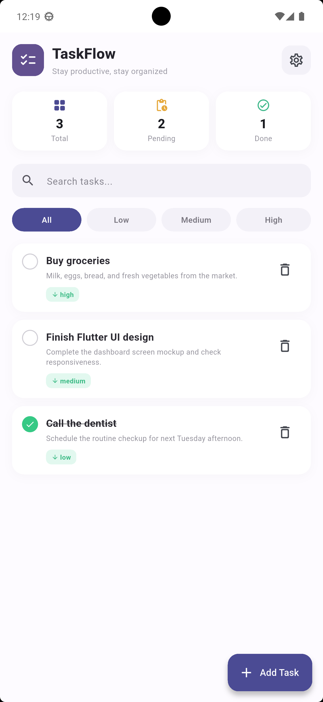
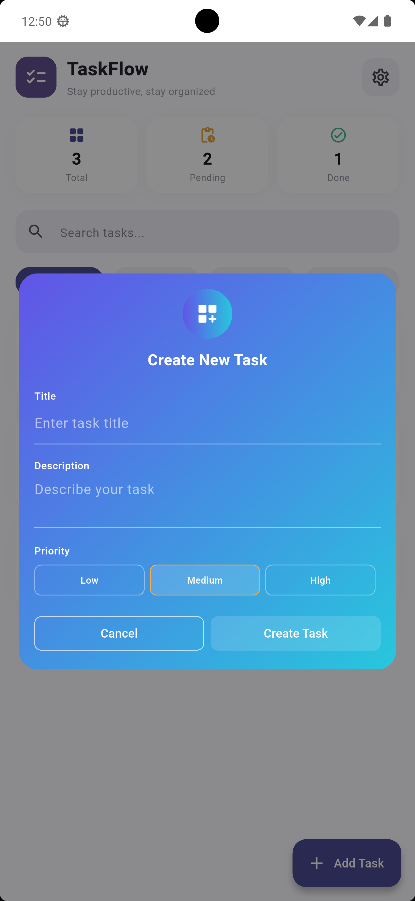
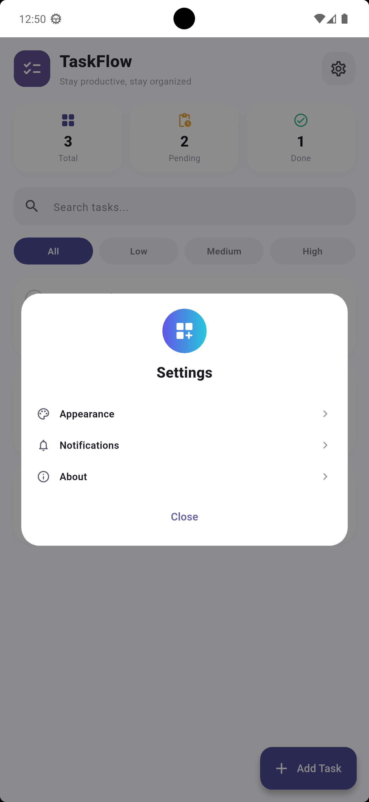

# 🚀 Taskflow

A modern, intuitive task management application built with Flutter. Taskflow helps you organize your daily activities, set priorities, and track your progress with a clean, beautifully designed user interface.

## 📱 Screenshots

*(Tip: Add screenshots of your app here once you push the code!)*
<p align="center">
   
   
   
</p>

## ✨ Features

* **Task Management:** Easily create, complete, and delete tasks.
* **Priority Tagging:** Assign tasks as Low, Medium, or High priority with custom color-coded UI indicators.
* **Smart Filtering:** Quickly filter your task list based on priority levels.
* **Real-time Search:** Instantly find specific tasks using the built-in search functionality.
* **Statistics Dashboard:** Track your productivity with a live overview of Total, Pending, and Completed tasks.
* **State Management:** Fast and responsive UI updates powered by the `provider` package.
* **Custom UI:** Beautiful gradient dialogs, custom icons, and smooth interactions.

## 🛠️ Tech Stack

* **Framework:** [Flutter](https://flutter.dev/)
* **Language:** Dart
* **State Management:** [Provider](https://pub.dev/packages/provider)


## 🚀 Getting Started

Follow these steps to run the project locally on your machine.

### Prerequisites
* Flutter SDK (Make sure Flutter is installed and configured)
* An IDE like VS Code or Android Studio

### Installation

1. **Clone the repository:**
   ```bash
   git clone [https://github.com/abdullahalsazib/taskflow.git](https://github.com/abdullahalsazib/taskflow.git)